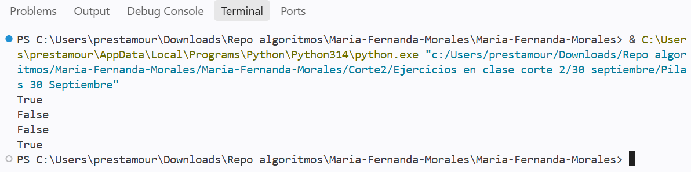
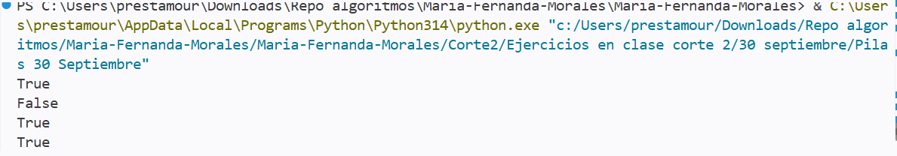

# Casos de la función `balanceados`

## Caso 1: `return p.vacia()`

## Caso 2: `return True`

## ¿Por qué pasa esto?

La función balanceados recorre la cadena carácter por carácter. Cada vez que encuentra un símbolo de apertura lo apila, y cada vez que encuentra uno de cierre desapila el tope y lo compara con el par que le corresponde. Si no coinciden, retorna False ahí mismo sin terminar de recorrer la cadena. En el caso 1, al final se retorna `p.vacia()`. Como la pila no está vacía, la función devuelve `False`, que es lo correcto porque la cadena no está balanceada. En el caso 2 se retorna `True` directamente.